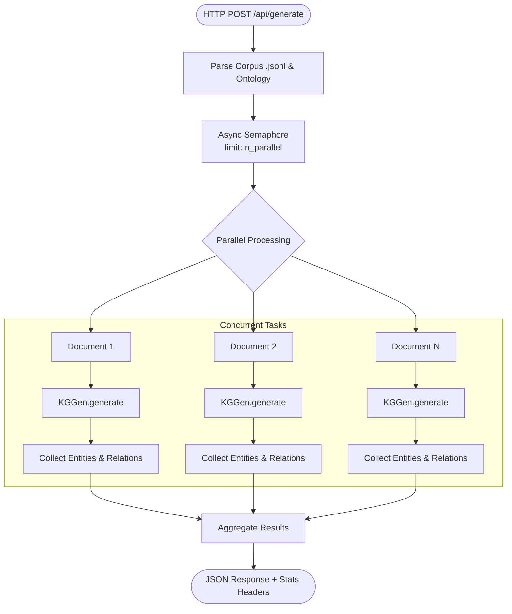
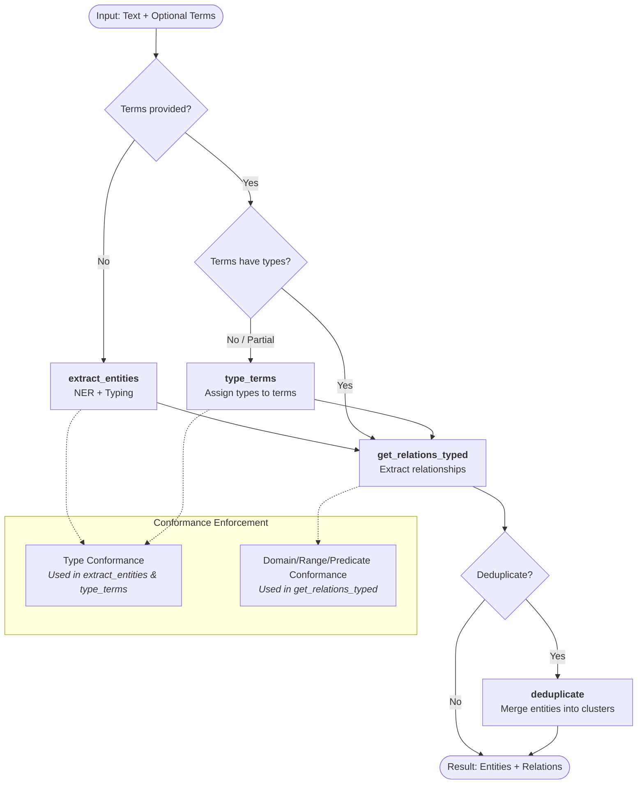

# KGGen: Knowledge Graph Extraction Approach

## 1. Executive Summary

**KGGen** is a high-performance framework designed to extract structured Knowledge Graphs (KG) from unstructured text files. By leveraging asynchronous processing and large language models (LLMs), it transforms raw text into typed entities and relations, supporting both cloud-based APIs and locally deployed models.

KGGen enables rapid, scalable knowledge extraction, designed for throughput. Its core strength lies in its ability to handle high-volume text ingestion while allowing for flexible model configuration, making it suitable for both enterprise-grade deployments and local development environments.

---

## 2. Core Functionality

KGGen provides a streamlined interface for Knowledge Graph construction.

### 2.1 Asynchronous Extraction
The system is built for speed, utilizing `asyncio` to process large corpora concurrently. By optimizing the ingestion of text chunks, KGGen maintains high throughput, significantly reducing the wall-clock time required to process large document sets.

### 2.2 LLM Flexibility & Deployment
KGGen is provider-agnostic. Whether utilizing proprietary models via API (e.g., GPT-4o) or running open-weights models locally via **Ollama** or **vLLM**, the architecture remains consistent. This allows users to balance performance, cost, and data privacy requirements by swapping the underlying engine without changing the core logic.

### 2.3 Knowledge Graph Lifecycle
The framework supports the full KG lifecycle, including:
*   **Entity & Relation Extraction:** Automated identification of typed entities and relations from text.
*   **Type Resolution:** Mapping identified terms to specific types to ensure structural consistency.
*   **Flexible Aggregation & Deduplication Ordering:** Independently processed graphs can be merged and deduplicated in different orders depending on requirements. In practical, large-scale workflows, it is often optimal to **aggregate first** and then run a single, unified global deduplication pass.

---

## 3. Operational Methodology & Processing Flow

KGGen follows a structured workflow designed to turn raw text into a queryable graph.

### 3.1 High-Level API Flow (`/api/generate`)
The service processes multi-line corpus files in parallel, controlled by the `n_parallel` parameter.

### 3.2 Internal Generation Flow (`KGGen.generate`)
Each document is processed through several steps depending on the provided input.

### 3.3 Detailed Step Descriptions

| Step | Description |
| :--- | :--- |
| **`extract_entities`** | Performs Named Entity Recognition (NER) and assigns types from the ontology in a single LLM call. Used when no initial terms are provided. |
| **`type_terms`** | Takes a list of user-provided terms (strings or untyped entities) and assigns ontology types to them. |
| **`get_relations_typed`** | Identifies relationships between the identified/provided entities. It uses the ontology to filter possible predicates and validate domain/range constraints. |
| **`deduplicate`** | Post-processing step that groups similar entities across the entire corpus and merges their properties and relations into a unified graph. |

---

## 4. Conformance & Quality Control

### 4.1 Conformance Enforcement
The system uses several flags to ensure the generated graph adheres to the provided ontology. These flags are used as constraints during LLM calls.

| Flag | Step(s) | Effect |
| :--- | :--- | :--- |
| `enforce_type_conformance` | `extract_entities`, `type_terms`, `get_relations_typed` | Ensures that entities are assigned types that actually exist in the ontology. |
| `enforce_domain_conformance` | `get_relations_typed` | Ensures the subject of a relation belongs to one of the valid domain classes for that predicate. |
| `enforce_range_conformance` | `get_relations_typed` | Ensures the object of a relation belongs to one of the valid range classes/datatypes for that predicate. |
| `enforce_predicate_conformance` | `get_relations_typed` | Restricts the LLM to only use predicates defined in the ontology. |

### 4.2 Non-Guaranteed Conformance (Feedback Loop)
Conformance checks are implemented using a feedback loop. If the extracted relations do not meet the ontology constraints, the system provides feedback to the LLM and requests a single retry.

**Important:** Because the system uses a single retry mechanism, **conformance is not strictly enforced or guaranteed**. If the model fails to produce a conforming result after the retry, the system returns the best available (non-conforming) result to prioritize throughput and avoid total failure of the ingestion pipeline.

---

## 5. A-Posteriori Deduplication & Clustering

Unlike systems that incrementally pass a growing, stateful partial Knowledge Graph back into the LLM context during the extraction of subsequent text chunks, KGGen performs deduplication **a-posteriori** on already constructed graphs.

### 5.1 Local Embedding Clustering
Deduplication is performed using **local embedding models** (e.g., `all-mpnet-base-v2` or `all-MiniLM-L6-v2`) to compute semantic similarity across nodes and edges. This allows the system to:
*   Collapse near-duplicates and synonyms to refine the graph's topology.
*   Merge entities and relations without requiring additional LLM calls, saving costs and improving speed.
*   Ensure data privacy by keeping the semantic analysis on-premises.

### 5.2 Trade-offs
*   **Disadvantages:**
    *   *Lack of Incremental Context:* Because chunks are processed completely independently, the extraction step cannot benefit from the context of already extracted entities. The LLM cannot be explicitly guided to reuse an exact surface form from previous chunks, which can result in more synonym variation that must be resolved later.
*   **Advantages:**
    *   *Full Parallelization:* Eliminating stateful, sequential dependencies between chunks allows the pipeline to process all text chunks concurrently, maximizing the speed of async rtime and local inference clusters (vLLM).
    *   *Infinite Scale:* Since a growing partial graph is never injected into the LLM context window during extraction, the system can process arbitrary-sized text corpora without running into context window limits.
    *   *Massive Token Savings:* Not pushing a cumulative, partial KG into the prompt for each new chunk prevents quadratic growth in token usage, dramatically decreasing both inference latency and API costs.

---

## 6. Technical Dependencies

The KGGen framework relies on a robust set of open-source libraries:

*   **LLM Orchestration (`dspy` & `langchain-core`):** Powers programmatic, structured, and retry-aware interactions with various language models.
*   **Graph Manipulation (`networkx`):** Serves as the core data structure to represent, merge, traverse, and export the extracted knowledge graphs.
*   **Semantic Embeddings (`sentence-transformers`):** Used to generate high-quality vector representations of entities and relationships for semantic similarity clustering via local models.
*   **Data Validation (`pydantic`):** Enforces strict data models, typed constraints, and schemas for entities, relations, graphs, and stats.
*   **Scientific Computing (`numpy`, `scikit-learn`):** Drives vector computation, cosine similarity, and thresholding during the clustering phase of deduplication.
*   **Optional MCP Support (`fastmcp` & `mcp`):** Enables seamless deployment of the tool suite as Model Context Protocol servers to integrate with MCP-compatible IDE clients or agents.

---

## 7. Pros and Cons

### Pros
*   **Exceptional Throughput:** Non-blocking `asyncio` execution combined with a-posteriori deduplication allows for massive parallel ingestion.
*   **Cost & Privacy Control:** Native compatibility with local models (vLLM, Ollama) and local embeddings eliminates per-token costs for these steps.
*   **Ontology Grounding:** Support for predefined types and constraints ensures structured results.
*   **Tracing and Auditability:** Complete provenance tracking for every node and relationship.

### Cons
*   **Post-processing Complexity:** Setting appropriate semantic thresholds is critical for accurate merging.
*   **Heavy Local Compute Requirements:** Demands significant GPU memory for hosting both the LLM and embedding models.
*   **Sensitivity to Model Capabilities:** Smaller models may struggle with strict structural prompts.

---

## 8. Technical Flexibility

The design of KGGen emphasizes decoupling:
*   **Configuration:** Configurable models, temperatures, and similarity thresholds.
*   **Extensibility:** Modular `generate` method allowing custom logic at each stage.
